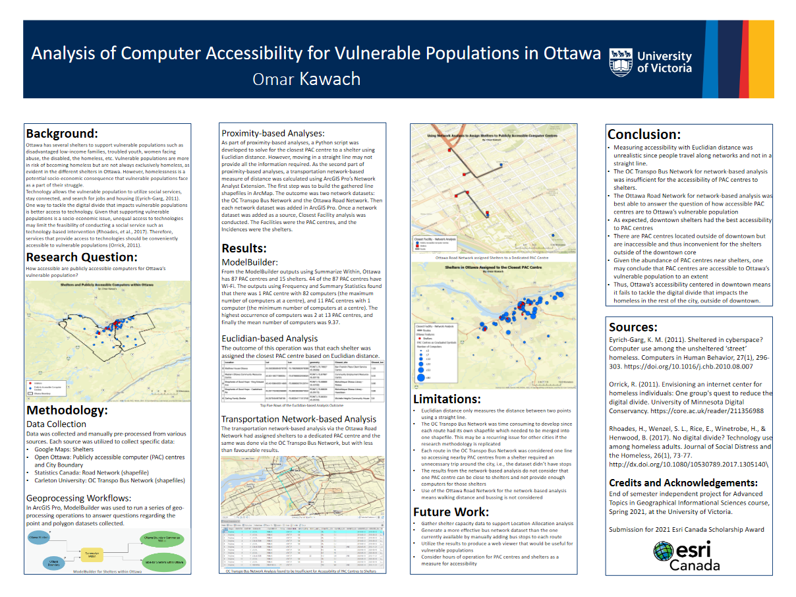

# Analysis of Computer Accessibility for Vulnerable Populations in Ottawa

**Author:** Omar Kawach

**Purpose:** Submission for the 2021 Esri Canada Higher Education Award

**Description:** Originally built as an end of semester independent project for my Advanced Topics in Geographical Informational Sciences Course at the University of Victoria

## Final Report

[Story Map: Computer Accessibility for Vulnerable Populations in Ottawa](https://storymaps.arcgis.com/stories/1a75bf5973444c4f8ac17684de716673)

## Poster



## Source Code

See [PACs Solver Jupyter Notebook](https://github.com/omarkawach/computer-access-for-homeless-in-ottawa/blob/main/notebooks/pacs_solver.ipynb)

### Run the Script 

#### Jupyter Notebook (in Browser)

[](https://mybinder.org/v2/gh/omarkawach/computer-access-for-homeless-in-ottawa.git/HEAD)

**Note:** The Binder may take a few minutes to build.

#### Windows

Install [*Anaconda Navigator*](https://www.anaconda.com/)

Get GeoPandas

- Open *Anaconda Prompt* as admin and [create a new environment](https://geopandas.readthedocs.io/en/latest/getting_started/install.html#creating-a-new-environment) called ```geo_env```.
- Next, open *Anaconda Navigator* and click on ```Home``` and set ```Applications on``` to ```geo_env``` instead of ```base (root)```. 
- Click the ```install``` button for *Spyder* in the *Anaconda Navigator*. 
- After all these steps you should be ready to run the new environment in Spyder for Python scripting. 

Other libraries such as Matplotlib
- Use ```pip install [name-of-library]``` in the ```geo_env```.

To use Jupyter Notebook in ```geo_env```
- Open *Anaconda Prompt* as admin and run ```pip install ipykernel``` and ```conda install pywin32```
- Download the Python extension in *VSCode*

## Credits and Acknowledgements

Special thank you to the University of Victoria for the nomination and my Advanced Topics in Geographical Informational Sciences Course, where this project was originally conducted, and was instructed by Professor Jessica Fitterer 

Jordahl, K. (2014). GeoPandas: Python tools for geographic data. URL: [https://github.com/Geopandas/Geopandas](https://github.com/Geopandas/Geopandas).

## Data Sources

[Ottawa Neighborhoods from Carleton University](https://library.carleton.ca/find/gis/geospatial-data/ottawa-neighbourhoods)

[Publicly Accessible Computers from Open Ottawa](https://open.ottawa.ca/datasets/publicly-accessible-computers)

[Shelters from a simple Google Search](https://www.google.com/search?q=shelters+ottawa&oq=shelters+ottawa&aqs=chrome..69i57j0j0i22i30l8.3326j0j7&sourceid=chrome&ie=UTF-8) 

[Road Network Files from Statistics Canada](https://www12.statcan.gc.ca/census-recensement/2011/geo/RNF-FRR/index-eng.cfm)

[OC Transpo Routes from Carleton University](https://library.carleton.ca/find/gis/geospatial-data/oc-transpo-transit-routes)