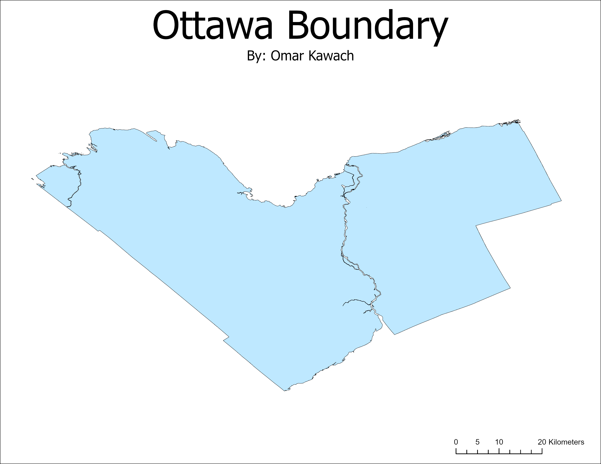

# How Accessible are Publicly Accessible Computers for Ottawa’s Homeless Population?

**Author:** Omar Kawach

**Description:** An end of semester independent project for GEOG 428 at the University of Victoria. 

**Note:** "Shelters" in this repository refer to organizations that offer health and social services such as housing, food, support for the vulnerable, etc. 

## Project Proposal

### Introduction

Over the years, the Alliance to End Homelessness Ottawa (ATEHO) has published research as part of their mission to find measures that tackle homelessness. The measures include targeted efforts, potential policies, and collaboration. Thus far, ATEHO’s publications lack mention of the importance of technology for the homeless population. Technology allows the homeless to utilize social services, stay connected, and search for jobs and housing (Eyrich-Garg, 2011). Considering that the City of Ottawa boasts an impressive amount of publicly accessible computers, the research to be conducted aims to fill the gaps on their accessibility for one of Ottawa’s most vulnerable people (i.e., the homeless). One approach to determine accessibility is to calculate the Euclidian distance between shelters and publicly accessible computers. The spatial analysis techniques in the research to be conducted follow the accessibility measures cited in a publication on access to urban health services (Apparicio et al., 2017). Therefore, the methodology itself is not unique, but the data and findings are. Additionally, Wi-Fi access will be considered as part of the research since areas with publicly accessible computers may offer free internet for people to connect to.

## Study Area



### Methods

Open Ottawa currently offers a feature layer of all the publicly accessible computers in the city of Ottawa (see Figure 1 below). The feature layer includes information on location, hours, number of computers, Wi-Fi access, etc. The data gathered from Open Ottawa will help to answer questions on accessibility. More specifically, proximity analysis will be used to answer questions like distance between shelters and services, Wi-Fi availability, and convenience in terms of hours of operation. 


**Figure 1.** Publicly Accessible Computers in the city of Ottawa as Provided by Open Ottawa

The raw data provided by Open Ottawa is ready to be analyzed as is, but steps remain. The proximity analysis will require data on all shelters in Ottawa. A simple search using Google outputs what is seen in Figure 2. The data from Google will need some preprocessing since a shelter in Gatineau was part of the search result and each result needs to be confirmed as a shelter. Once all necessary data is collected, a program will be written in Python to conduct proximity analysis. For example, a program could be made to solve for the closest publicly accessible computer to a shelter which would require Euclidian distance and the data that was gathered and preprocessed. Naturally, the program would also need to specify a mutual coordinate reference system between datasets so that the program can work accurately with geometries. 


 
**Figure 2.** Shelters in Ottawa according to Google Maps

### Contribution

To tackle the digital divide that impacts the homeless, services that provide access to technologies should be conveniently accessible (i.e., close to shelters and open when shelters are unable to serve people) (Orrick, 2011). Given that homelessness is a socio-economic issue, the results obtained from these analyses may provide answers to questions concerning unequal access to technologies within a city. Access to technologies in this case refers to how conveniently located publicly accessible computers are, how much internet access is offered alongside computer access, and whether shelter access may conflict with public services access. Moreover, due to the limitations involved with access to technologies, the feasibility of conducting a social service such as technology-based intervention may be compromised due to internet access issues (Rhoades, et al., 2017). Therefore, the findings in the research conducted may supplement existing research by providing a unique GIS perspective; allowing Ottawa to discover how truly accessible their publicly accessible computers are. 

## Project Development

See [PACs Solver Jupyter Notebook](https://github.com/omarkawach/computer-access-for-homeless-in-ottawa/blob/main/notebooks/pacs_solver.ipynb)

## Development Instructions 

### Jupyter Notebook (in Browser)

[](https://mybinder.org/v2/gh/omarkawach/computer-access-for-homeless-in-ottawa.git/HEAD)

**Note:** The Binder may take a few minutes to build.

### Windows

Install [*Anaconda Navigator*](https://www.anaconda.com/)

Get GeoPandas

- Open *Anaconda Prompt* as admin and [create a new environment](https://geopandas.readthedocs.io/en/latest/getting_started/install.html#creating-a-new-environment) called ```geo_env```.
- Next, open *Anaconda Navigator* and click on ```Home``` and set ```Applications on``` to ```geo_env``` instead of ```base (root)```. 
- Click the ```install``` button for *Spyder* in the *Anaconda Navigator*. 
- After all these steps you should be ready to run the new environment in Spyder for Python scripting. 

Other libraries such as Matplotlib
- Use ```pip install [name-of-library]``` in the ```geo_env```.

To use Jupyter Notebook in ```geo_env```
- Open *Anaconda Prompt* as admin and run ```pip install ipykernel``` and ```conda install pywin32```
- Download the Python extension in *VSCode*

## Sources

Apparicio, P., Gelb, J., Dubé, A., Kingham, S., Gauvin, L., & Robitaille, É. (2017). The approaches to measuring the potential spatial access to urban health services revisited: distance types and aggregation-error issues. International Journal of Geographics, 16(1). https://doi.org/10.1186/s12942-017-0105-9 

Eyrich-Garg, K. M. (2011). Sheltered in cyberspace? Computer use among the unsheltered ‘street’ homeless. Computers in Human Behavior, 27(1), 296-303. https://doi.org/10.1016/j.chb.2010.08.007 

Orrick, R. (2011). Envisioning an internet center for homeless individuals: One group's quest to reduce the digital divide. University of Minnesota Digital Conservancy. https://core.ac.uk/reader/211356988 

Rhoades, H., Wenzel, S. L., Rice, E., Winetrobe, H., & Henwood, B. (2017). No digital divide? Technology use among homeless adults. Journal of Social Distress and the Homeless, 26(1), 73-77. http://dx.doi.org/10.1080/10530789.2017.1305140 

## Credits

Jordahl, K. (2014). GeoPandas: Python tools for geographic data. URL: [https://github.com/Geopandas/Geopandas](https://github.com/Geopandas/Geopandas).

## Data

Open Ottawa - [Publicly Accessible Computers](https://open.ottawa.ca/datasets/publicly-accessible-computers/data?geometry=-77.710%2C45.058%2C-73.538%2C45.733)